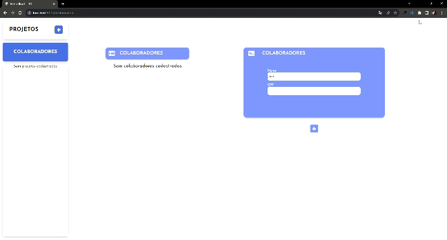
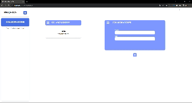
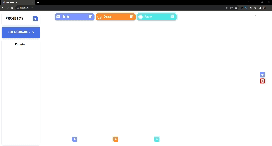
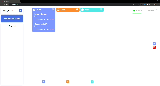
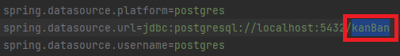

<h3 align="center">
  Projeto Kanban📝
</h3>

## 🔖 Informações

- Aplicação para gestão de tarefas
- Projeto Full-stack com Postgresql

## 🖼 Screenshot das telas da aplicação






<br/>


## 🚀 Tecnologias utilizadas 

<br/>
<p align="left">
  <a href="https://developer.mozilla.org/pt-BR/docs/Web/HTML/Element" target="_blank">
    
  </a>

  <a href="https://developer.mozilla.org/en-US/docs/Web/CSS" target="_blank">
    
  </a>
  
  <a href="https://developer.mozilla.org/en-US/docs/Web/JavaScript" target="_blank">
    
  </a>

  <a href="https://docs.spring.io/spring-boot/docs/current/reference/htmlsingle/" target="_blank">
    
  </a>
  <a href="https://docs.oracle.com/en/java/" target="_blank">
    
  </a>
  <a href="https://legacy.reactjs.org/docs/getting-started.html" target="_blank">
    
  </a>
  <a href="https://pt.m.wikipedia.org/wiki/Ficheiro:Postgresql_elephant.svg" target="_blank">
    
  </a>
  <a href="https://sass-lang.com/documentation/" target="_blank">
    
  </a>

  

  


</p>


### :memo: A aplicação permite:

*   Cadastro de tarefas;
*   Cadastro de projetos;
*   Cadastro de colaboradores;
*   Cadastro de filas (3 filas padrões);
*   Movimentação de filas;
*   Deleção de componentes cadastrados (filas, projetos, tarefas e colaboradores);
*   Listagem de dados cadastrados (filas, projetos, tarefas e colaboradores);
*   Atualização de informações cadastradas; 

# 👷 Como rodar

```bash
# Clonar o repositório
git clone https://github.com/JoaoVMoreira/KanBan.git .

BACKEND:

# Abrir o diretorio BackEnd no compilador de sua preferência
# Criar banco de dados com o nome kanBan
# OBS: Caso deseje realizar a alteração do nome do banco de dados
# alterar em application.properties, linha 3:
```


```bash

FRONTEND: 

# Abrir diretorio FrontEnd no compilador de sua preferência
# No terminal, utilizar o comando:
npm run dev


```

## :mortar_board: Autor

<table align="center">
    <tr>
        <td align="center">
            <a href="https://github.com/JoaoVMoreira">
                <sub><b>João Vittor Moreira de Oliveira</b></sub>
            </a>
        </td>    
    </tr>
</table>
<h4 align="center">
   Feito com 💜 by  <a href="https://www.linkedin.com/in/jvittormoreira/" target="_blank"> João Moreira </a>
</h4>